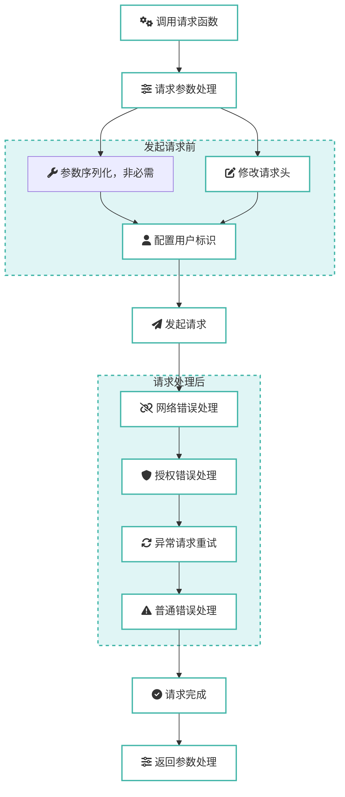

# axios-easy

<p align="center">
  <a href="https://codecov.io/gh/GreatAuk/axios-easy" >
  
  </a>
  <a href="https://www.npmjs.com/package/axios-easy" target="__blank">
    
  </a>
  <!-- <a href="https://www.npmjs.com/package/@plugin-web-update-notification/core" target="__blank"></a> -->
  <a href="https://github.com/GreatAuk/axios-easy/blob/main/LICENSE">
    
  </a>
  <br>
</p>

`axios-easy` 是一个模块化的 `TypeScript` 库，它通过一系列可组合的拦截器和实用程序扩展了 `axios` ，以标准化 `HTTP` 请求/响应处理。该库提供了即插即用的拦截器，用于处理常见的 `Web` 应用程序问题，包括身份验证、错误处理、负载规范化、参数序列化和文件处理。

## 目录

- [✨ 特性](#-特性)
- [📦 安装](#-安装)
- [📊 请求流程图](#-请求流程图)
- [🚀 快速上手](#-快速上手)
- [📚 API 文档](#-api-文档)
  - [axios-easy/createRequestClient](#axios-easycreaterequestclient)
  - [axios-easy/default-request-interceptor](#axios-easydefault-request-interceptor)
  - [axios-easy/default-response-interceptor](#axios-easydefault-response-interceptor)
  - [axios-easy/error-message-interceptor](#axios-easyerror-message-interceptor)
  - [axios-easy/authenticate-interceptor](#axios-easyauthenticate-interceptor)
  - [axios-easy/params-serializer-interceptor](#axios-easyparams-serializer-interceptor)
  - [axios-easy/utils](#axios-easyutils)
- [搭配 openapi-ts-request 使用](#搭配-openapi-ts-request-使用-查看)
- [🤝 贡献](#-贡献)
- [📄 许可证](#-许可证)

## ✨ 特性

- **🔌 高度可组合**: 提供独立的拦截器，你可以像乐高积木一样按需组合，只添加你需要的功能。
- **🌳 Tree-Shakable**: 所有工具和拦截器都支持按需加载，确保最终打包体积最小化。
- **🚀 功能强大**: 内置认证、请求参数格式化、响应格式化、错误处理、请求重试（集成的第三方）、文件下载等常用场景的最佳实践。
- **🌐 国际化支持**: 错误信息拦截器内置中英文国际化支持，支持全局语言管理和动态切换。
- **💧 类型友好**: 使用 TypeScript 编写，提供完整的类型定义，带来卓越的开发体验。
- **👌 使用简单**: API 设计简洁直观，只需几行代码即可集成到你的项目中，没有其他黑科技，只是通过 `axios` 拦截器来实现，源码简单易懂。
- **🧪 单元测试**: 所有功能都有单元测试覆盖，确保功能稳定可靠。

## 📦 安装

```bash
pnpm add axios-easy
# or
npm install axios-easy
# or
yarn add axios-easy
```

或从内部镜像安装：

```bash
pnpm add @sp/axios-easy
```

PS: `axios` 版本最好 `1.12.0` 以上，否则 ts 类型会报错。

## 📊 请求流程图



## 🚀 快速上手方式一：

**搭积木一样，根据你需要的拦截器按需导入。可定制程度较高，也更符合之前的编程习惯：创建 axios 实例，然后添加各种拦截器。**

下面是一个集成了所有核心拦截器的示例，展示了 `axios-easy` 的使用方法，这是一个比较完整的示例，你简单修改后可以直接使用。
tr
```ts
import type { AxiosError, AxiosResponse } from 'axios';
import axios from 'axios';

// 从各个模块按需导入你需要的拦截器创建函数
import { createDefaultRequestInterceptor } from 'axios-easy/default-request-interceptor';
import { createDefaultResponseInterceptor } from 'axios-easy/default-response-interceptor';
import { createAuthenticateInterceptor } from 'axios-easy/authenticate-interceptor';
import { createErrorMessageInterceptor, setGlobalLanguage } from 'axios-easy/error-message-interceptor';

// 使用 qs 库对请求参数进行序列化，这个一般不需要使用，用于发送 application/x-www-form-urlencoded 格式的数据。默认的 application/json 数据（这也是现代 Web 开发中最常见的）就可以了。
// import { createParamsSerializerInterceptor } from 'axios-easy/params-serializer-interceptor';

// 请求重试功能，如果使用，请安装 axios-retry
// import axiosRetry from 'axios-retry';

/** 假设你的接口返回数据结构如下 */
type ApiResponse<T> = {
  resultCode: 'SUCCESS' | 'FAIL';
  data: T;
  errorCode?: string;
  errorCodeDes?: string;
};

/** 和后端约定好的登录失效错误码 */
const AUTH_ERROR_CODES = [
  'KICK_OUT', // Token已被踢下线
  'LOGIN_REPLACE', // 登录被顶下线
  'NOT_TOKEN',
  'TOKEN_DEFAULT_ERROR', // 当前会话未登录
  'TOKEN_TIMEOUT', // Token 已过期
]

// 设置错误信息语言（可选，默认中文）
// setGlobalLanguage('en'); // 设置为英文

// 创建 Axios 实例
const axiosInstance = axios.create({
  baseURL: 'https://api.example.com',
  responseReturn: 'body',
  errorMessageMode: 'message',
  timeout: 30 * 1000,
  headers: {
    'Content-Type': 'application/json;charset=utf-8',
  },
});

// 添加你自己的业务请求拦截器 (例如：添加 token)
axiosInstance.interceptors.request.use((config) => {
  const token = localStorage.getItem('access_token');
  if (token) {
    config.headers.Authorization = `Bearer ${token}`;
  }
  return config;
});

// 应用参数序列化拦截器 (可选，需要发送 application/x-www-form-urlencoded 数据时使用)
// createParamsSerializerInterceptor(axiosInstance, {
//   qsStringifyArrayFormat: 'brackets' // 按需选择，不传也行，默认使用 indices 格式。
// });

 // 应用默认请求拦截器
createDefaultRequestInterceptor(axiosInstance, {
  extendTimeoutWhenDownload: true, // 下载文件时自动延长超时时间（默认超时时间 * 10），防止因文件过大导致下载超时
  normalizePayload: {
    trim: true,           // 去除字符串首尾空白
    dropUndefined: true,  // 删除 undefined 值
    emptyStringToNull: true, // 空字符串转为 null
  },
});

// 应用默认响应拦截器 (处理 response 数据结构)
createDefaultResponseInterceptor(axiosInstance, {
  codeField: 'resultCode',
  dataField: 'data',
  successCode: 'SUCCESS',
  isThrowWhenFail: true,   // 当业务请求失败时（状态码不匹配 `successCode`），是否抛出错误。设置为 `true` 后，业务错误将进入 `catch` 块。
});

// 认证拦截器, 支持无感刷新 token。用于登录失效
createAuthenticateInterceptor(axiosInstance, {
  isAuthenticateFailed: (error: AxiosError<ApiResponse<any>>) => {
    // 自定义逻辑判断登录是否失效
    return error.response?.status === 401 || AUTH_ERROR_CODES.includes(errorCode!)
  },
  doReAuthenticate: async (error: AxiosError<Response<any>, any>) => {
    // 登录失效或刷新 token 失败后的行为，一般是跳转登录页面
    const { errorCode } = error.response?.data || {} // 可以针对后端返回的错误码进行不同处理
    window.location.href = '/login';
  },
  enableRefreshToken: true, // 启用无感刷新 token 功能
  doRefreshToken: async () => {
    // 实现刷新 token 的逻辑
    const res = await axiosInstance.post('/refresh-token', {
      refreshToken: localStorage.getItem('refresh_token'),
    });
    const { token, refreshToken } = res.data;
    localStorage.setItem('access_token', token);
    localStorage.setItem('refresh_token', refreshToken);
  },
});

// 请求重试，如果需要使用，请安装 axios-retry, 参考：https://github.com/softonic/axios-retry
// axiosRetry(axiosInstance, {
//   retries: 3
// })

// 应用错误消息拦截器 (统一错误提示, 在这里定义业务错误提示)
createErrorMessageInterceptor(axiosInstance, {
  handler: (errorResponse: AxiosResponse<ApiResponse<any>>, networkErrMsg) => {
    if (!errorResponse.config || !errorResponse.data) {
      return;
    }
    const { data, config } = errorResponse;

    // 如果单独配置了不提示错误信息，则直接返回
    if (config?.errorMessageMode === 'none') {
      return;
    }

    const errorMessage = data?.errorCodeDes || networkErrMsg || data?.errorCode || '未知错误';

    // 这里使用你项目中的 UI 组件库来显示错误，例如 Element Plus
    if (config?.errorMessageMode === 'message') {
      // 如果没有错误信息，则会根据状态码进行提示
      ElMessage({
        message: errorMessage,
        type: 'error',
        plain: true,
        grouping: true,
      });
    } else if (config?.errorMessageMode === 'modal') {
      ElMessageBox({
        title: '错误提示',
        message: errorMessage,
        type: 'error',
        showCancelButton: false,
        confirmButtonText: '知道了',
      }).catch(() => { });
    }
  },
  defaultLanguage: 'zh',
});
```

```ts
// 现在，你可以使用配置好的 axiosInstance 发起请求了
async function getUserInfo() {
  try {
    // 拦截器会自动处理数据，你直接拿到的就是 data 字段(axios 的原始响应对象)的内容
    const userInfo = await axiosInstance.get<ApiResponse<{ id: number; name: string }>>('/user/info', {
      errorMessageMode: 'modal',
    });
    console.log(userInfo); // { id: 1, name: 'Alice' }
  } catch (error) {
    console.error('获取用户信息失败');
  }
}
```

## 快速上手方式二

**工厂模式，一个函数搞定所有拦截器。根据你的需要开启**

`createRequestClient` 将常用拦截器打包成可配置的工厂，开箱即可获得下载超时扩展、请求体规范化、响应结构转换、认证重试和错误提示等能力，同时又允许你按需拓展，让接入体验与定制能力兼得。

```ts
import type { AxiosError, AxiosResponse } from 'axios';
import { createRequestClient } from 'axios-easy/create-request-client';

/** 假设你的接口返回数据结构如下 */
type ApiResponse<T> = {
  resultCode: 'SUCCESS' | 'FAIL';
  data: T;
  errorCode?: string;
  errorCodeDes?: string;
};

/** 和后端约定好的登录失效错误码 */
const AUTH_ERROR_CODES = [
  'KICK_OUT',
  'LOGIN_REPLACE',
  'NOT_TOKEN',
  'TOKEN_DEFAULT_ERROR',
  'TOKEN_TIMEOUT',
];

const { axiosInstance, request, setGlobalLanguage } = createRequestClient({
  axiosConfig: {
    baseURL: 'https://api.example.com',
    responseReturn: 'body',
    errorMessageMode: 'message',
    timeout: 30 * 1000,
  },
  // 使用 qs 库对请求参数进行序列化，这个一般不需要使用，用于发送 application/x-www-form-urlencoded 格式的数据。
  paramsSerializer: false,
  /** 是否启用默认请求拦截器。true 表示使用默认配置（下载延长超时 & 请求体规范化-去除字符串首尾空白开启） */
  defaultRequest: true,
  defaultResponse: {
    codeField: 'resultCode',
    dataField: 'data',
    successCode: 'SUCCESS',
    isThrowWhenFail: true,
  },
  authenticate: (instance) => ({
    isAuthenticateFailed: (error) => {
      const errorCode = error.response?.data?.errorCode;
      return error.response?.status === 401 || (errorCode ? AUTH_ERROR_CODES.includes(errorCode) : false);
    },
    doReAuthenticate: async (_error: AxiosError<ApiResponse<any>>) => {
      window.location.href = '/login';
    },
    enableRefreshToken: true,
    doRefreshToken: async () => {
      const res = await instance.post('/refresh-token', {
        refreshToken: localStorage.getItem('refresh_token'),
      });
      const { token, refreshToken } = res.data;
      localStorage.setItem('access_token', token);
      localStorage.setItem('refresh_token', refreshToken);
    },
  }),
  errorMessage: {
    handler: (errorResponse: AxiosResponse<ApiResponse<any>>, networkErrMsg) => {
      if (!errorResponse.config || !errorResponse.data) {
        return;
      }

      if (errorResponse.config.errorMessageMode === 'none') {
        return;
      }

      const errorMessage = errorResponse.data?.errorCodeDes || networkErrMsg || errorResponse.data?.errorCode || '未知错误';

      if (errorResponse.config.errorMessageMode === 'message') {
        ElMessage({
          message: errorMessage,
          type: 'error',
          plain: true,
          grouping: true,
        });
      } else if (errorResponse.config.errorMessageMode === 'modal') {
        ElMessageBox({
          title: '错误提示',
          message: errorMessage,
          type: 'error',
          showCancelButton: false,
          confirmButtonText: '知道了',
        }).catch(() => {});
      }
    },
    defaultLanguage: 'zh',
  },
  setup: (client) => {
    // 这里可以继续挂载第三方插件，例如 axios-retry
    // axiosRetry(client, { retries: 3 });

    client.interceptors.request.use((config) => {
      const token = localStorage.getItem('access_token');
      if (token) {
        config.headers.Authorization = `Bearer ${token}`;
      }
      return config;
    });
  },
});

// 可选：设置全局错误提示语言
// setGlobalLanguage('en');
```

```ts
// 现在，你可以使用配置好的 axiosInstance 发起请求了
async function getUserInfo() {
  try {
    const userInfo = await axiosInstance.get<ApiResponse<{ id: number; name: string }>>('/user/info', {
      errorMessageMode: 'modal',
    });
    console.log(userInfo); // { id: 1, name: 'Alice' }
  } catch (error) {
    console.error('获取用户信息失败');
  }
}

async function getPetInfo() {
  const petInfo = await request('/api/pet/1', {
    errorMessageMode: 'modal',
  });
  console.log(petInfo); // { id: 1, name: 'Alice' }
}
```

## 📚 API 文档

### axios-easy/default-request-interceptor

[source](https://github.com/GreatAuk/axios-easy/blob/main/src/default-request-interceptor/index.ts)

此拦截器用于优化请求行为。

**功能**:
- **下载场景下延长 timeout**: 当检测到请求是用于下载文件时（`responseType` 为 `'blob'` 或 `'arraybuffer'`），会自动延长该请求的超时时间（默认为基础超时时间的 10 倍），防止因文件过大导致下载超时；如需更灵活的策略，可传入函数接收默认超时时间并返回定制值。
- **请求参数规范化**: 支持在发送请求前对 `data` 和 `params` 进行统一的数据清洗，包括字符串 trim、删除 undefined 值、空字符串转 null 等操作。

**配置选项 (`DefaultRequestInterceptorOptions`)**:

```ts
import type { InternalAxiosRequestConfig } from 'axios';

export type DefaultRequestInterceptorOptions = {
  /**
   * 当请求是下载文件时（`responseType` 为 `'blob'` 或 `'arraybuffer'`），
   * 是否自动延长请求的超时时间，以防止因文件过大导致下载超时。
   * @default true
   */
  extendTimeoutWhenDownload?: boolean | ((defaultTimeout: number, config: InternalAxiosRequestConfig) => number);
  /**
   * 是否在请求前规范化传参（仅处理普通对象/数组）
   * - trim: 是否去除字符串首尾空白，默认 false
   * - dropUndefined: 是否删除值为 undefined 的键/数组元素，默认 false
   * - emptyStringToNull: 是否将空字符串转换为 null，默认 false
   */
  normalizePayload?: {
    trim?: boolean;
    dropUndefined?: boolean;
    emptyStringToNull?: boolean;
  };
};
```

**类型扩展**:
此拦截器会为 `AxiosRequestConfig` 扩展一个新的属性：
```ts
interface AxiosRequestConfig {
  /**
   * 是否在请求前规范化传参（仅处理普通对象/数组）
   * - trim: 是否去除字符串首尾空白，默认 false
   * - dropUndefined: 是否删除值为 undefined 的键/数组元素，默认 false
   * - emptyStringToNull: 是否将空字符串转换为 null，默认 false
   *
   * 未设置时，等价于 `{ trim: false, dropUndefined: false, emptyStringToNull: false }`
   */
  normalizePayload?: {
    trim?: boolean;
    dropUndefined?: boolean;
    emptyStringToNull?: boolean;
  };
}
```

**使用**:
```ts
import { createDefaultRequestInterceptor } from 'axios-easy/default-request-interceptor';

createDefaultRequestInterceptor(axiosInstance, {
  extendTimeoutWhenDownload: true, // 布尔值时沿用默认策略：下载请求且未单独设置 timeout 时，将默认超时时间放大 10 倍
  normalizePayload: {
    trim: true,           // 去除字符串首尾空白
    dropUndefined: true,  // 删除 undefined 值
    emptyStringToNull: true, // 空字符串转为 null
  },
});

// 也可以在单个请求中配置，会覆盖拦截器的全局配置
axiosInstance.post('/api/users',
  {
    name: ' Alice  ',
    age: undefined,
    email: '   '
  },
  {
    normalizePayload: {
      trim: true,
      dropUndefined: true,
      emptyStringToNull: true,
    }
  }
);
// 实际发送的数据为: { name: 'Alice', email: null }
```

### axios-easy/createRequestClient

[source](https://github.com/GreatAuk/axios-easy/blob/main/src/createRequestClient.ts)

`createRequestClient` 将常见拦截器组合为一体化工厂：默认开启下载延时和数据规范化，可选启用响应解析、认证刷新、错误提示、参数序列化与 token 注入，并提供 `setup` 钩子扩展自定义逻辑。

**类型定义 (`CreateRequestClientOptions`)**：

```ts
import type { AxiosInstance, CreateAxiosDefaults } from 'axios';
import type { AuthenticateInterceptorOptions } from 'axios-easy/authenticate-interceptor';
import type { DefaultRequestInterceptorOptions } from 'axios-easy/default-request-interceptor';
import type { DefaultResponseInterceptorOptions } from 'axios-easy/default-response-interceptor';
import type { HandleErrorMessage, SupportedLanguage } from 'axios-easy/error-message-interceptor';
import type { ParamsSerializerInterceptorOptions } from 'axios-easy/params-serializer-interceptor';

type ErrorMessageOptions = {
  handler: HandleErrorMessage;
  defaultLanguage?: SupportedLanguage;
};

type CreateRequestClientOptions = {
  axiosConfig?: CreateAxiosDefaults;
  defaultRequest?: boolean | DefaultRequestInterceptorOptions;
  defaultResponse?: false | DefaultResponseInterceptorOptions;
  authenticate?: false | ((client: AxiosInstance) => AuthenticateInterceptorOptions);
  errorMessage?: false | ErrorMessageOptions;
  paramsSerializer?: boolean | ParamsSerializerInterceptorOptions;
  setup?: (client: AxiosInstance) => void;
};
```

**使用**：

```ts
import { createRequestClient } from 'axios-easy';

const client = createRequestClient({
  defaultRequest: true,
  defaultResponse: {
    codeField: 'code',
    dataField: 'data',
    successCode: 0,
  },
  authenticate: (instance) => ({
    enableRefreshToken: false,
    doReAuthenticate: async () => {
      window.location.href = '/login';
    },
  }),
  setup: (instance) => {
    instance.interceptors.request.use((config) => {
      console.log('[debug] request url:', config.url);
      return config;
    });
  },
});

const data = await client.get('/api/example');
```

> 将配置设为 `false` 可以彻底关闭对应模块；保持 `true` 使用默认行为；传入对象或工厂函数则进入细粒度自定义，使默认体验与灵活拓展兼容。

---

### axios-easy/default-response-interceptor

[source](https://github.com/GreatAuk/axios-easy/blob/main/src/default-response-interceptor/index.ts)

此拦截器用于标准化响应数据结构，让你在业务代码中只关心核心数据。

**功能**:
- **自动解包**: 根据后端返回的结构，自动提取核心业务数据。
- **业务成功判断**: 根据你定义的成功码（`successCode`），判断业务请求是否成功。如果失败，则抛出错误，交由后续的错误拦截器处理。
- **灵活的返回类型**: 通过在请求 `config` 中设置 `responseReturn`，可以控制返回的数据格式：
    - `'raw'`: 返回原始的 Axios 响应对象。
    - `'body'`: 返回响应体 `response.data`。
    - `'data'`: 返回响应体中的核心数据字段 `response.data[dataField]`。

**配置选项 (`DefaultResponseInterceptorOptions`)**:

```ts
export type DefaultResponseInterceptorOptions = {
  /**
   * 响应数据中代表业务状态码的字段名。
   * @default 'code'
   */
  codeField: string;
  /**
   * 响应数据中代表核心业务数据的字段名，或一个函数，用于从响应体中提取数据。
   * @default 'data'
   */
  dataField: ((response: any) => any) | string;
  /**
   * 定义业务成功的状态码值。
   * 可以是一个具体的值，或一个函数，返回 `true` 表示成功。
   * @default 0
   */
  successCode: ((code: any) => boolean) | number | string;
  /**
   * 当业务请求失败时（状态码不匹配 `successCode`），是否抛出错误。
   * 设置为 `true` 后，业务错误将进入 `catch` 块。
   * @default true
   */
  isThrowWhenFail?: boolean;
};
```

**类型扩展**:
此拦截器会为 `AxiosRequestConfig` 扩展一个新的属性：
```ts
interface AxiosRequestConfig {
  /**
   * 响应数据的返回方式。
   * - raw: 原始的 AxiosResponse，包括 headers、status 等，不做是否成功请求的检查。（返回 `axiosRes`）
   * - body: 返回响应数据的 body 部分。（返回 `axiosRes.data` ）
   * - data: 解构响应的 body 数据，只返回其中的 dataField 节点数据。（返回 `axiosRes.data.list`）
   * @default 'body'
   *
   * **axiosRes 是 axios 的默认响应对象**
   * ```ts
   * const axiosRes = {
      // `data` 由服务器提供的响应
      data: {
        code: 0,
        list: [],
        errorMessage: '',
      },
      // `status` 来自服务器响应的 HTTP 状态码
      status: 200,,
      // `headers` 是服务器响应头
      headers: {},
      ...
    }
    * ```
  */
  responseReturn?: 'body' | 'data' | 'raw';
}
```

**使用**:
```ts
import { createDefaultResponseInterceptor } from 'axios-easy/default-response-interceptor';

// 假设后端接口结构为 { resultCode: 'SUCCESS', data: { ... } }
createDefaultResponseInterceptor(axiosInstance, {
  codeField: 'resultCode',
  dataField: 'body',
  successCode: 'SUCCESS',
  isThrowWhenFail: true,
});
```

**注意**
默认的配置（`isThrowWhenFail: true`），接口的业务错误(`resultCode: 'FAIL'`)会被 throw，交由后续的错误拦截器处理，你无需手动处理。

> 优点：
> 简化业务代码：业务层面只需要关注成功的逻辑
> 统一错误处理：所有错误都在拦截器中统一处理
> 提高可维护性：错误处理逻辑集中，易于修改和扩展
> 符合开发规范：遵循了单一职责和关注点分离原则

简单的使用示例：
```ts
try {
  const res = await axiosInstance.get('/api/user/info');
  /* 这里只处理成功情况（且只有 res.resultCode === 'SUCCESS' 才会进入），代码更清晰 */
  console.log(res.data);
} catch (err) {
  /*
   * 这里会捕获所有错误：
   * 1. 网络错误（404、500等）
   * 2. 业务错误（resultCode: 'FAIL'）
   * 3. 代码执行错误（如 res 不存在）
   * 因为没有设置 options.errorMessageMode: 'none'，所以错误信息已在拦截器中统一处理和展示
   */
  console.error(err);
}
```

如果个别接口你不使用默认的错误处理，可以在请求配置中设置 `errorMessageMode: 'none'`
```ts
try {
  const res = await axiosInstance.get('/api/user/info', {
    errorMessageMode: 'none', // // 默认有错误，会在 axios 响应拦截器中直接使用 ElMessage(由 createErrorMessageInterceptor 的配置决定) 提示错误信息。这里设置为 'none'，需要自己处理错误
  });
  /* 这里只处理成功情况（且只有 res.resultCode === 'SUCCESS' 才会进入），代码更清晰 */
  console.log(res.data);
} catch (err) {
  if (isServerError(err) && err.errorCode === 'Expired') {
    // 因为上面设置了 errorMessageMode: 'none'，所以这里需要自己处理错误。
    console.log('操作已过期');
  } else {
    // 非后端业务报错，直接打印
    console.error(err);
  }
}
```

为了 ts 类型友好，判断是否是后端错误，可以参考如下示例封装一个 utils 函数：

```ts
/**
 * 判断是否是后端错误 (公司项目约定的统一错误返回格式)
 * @param error 错误对象
 * @returns 是否是后端错误
 */
export function isServerError(error: any): error is ServerError {
  if (typeof error !== 'object' || error === null) {
    return false;
  }
  return (
    // 这里根据和后端约定的返回数据结构来判断
    Reflect.has(error, 'resultCode') &&
    Reflect.has(error, 'errorCode') &&
    Reflect.has(error, 'errorCodeDes')
  );
}
```
---

### axios-easy/error-message-interceptor

[source](https://github.com/GreatAuk/axios-easy/blob/main/src/error-message-interceptor/index.ts)

此拦截器用于统一捕获和处理所有请求错误，并提供友好的错误提示。

**功能**:
- **标准化错误信息**: 将网络错误、超时、HTTP 错误（4xx, 5xx）等转化为用户易于理解的提示信息。
- **国际化支持**: 支持中英文错误信息，提供全局语言管理和请求级别语言设置。
- **自定义处理**: 你需要提供一个处理函数，来自定义如何显示错误信息（例如使用 `Message` 或 `Modal` 组件）。

**配置选项 (`ErrorMessageInterceptorOptions`)**:

```ts
export type ErrorMessageInterceptorOptions = {
  /** 自定义错误提示处理函数 */
  handler: HandleErrorMessage;
  /** 默认语言，默认为中文。如果不提供，将使用全局语言设置 */
  defaultLanguage?: SupportedLanguage;
}
```

**类型扩展**:
此拦截器会为 `AxiosRequestConfig` 扩展新的属性：
```ts
interface AxiosRequestConfig {
  /**
   * Error message prompt type。这个提示 ui 需要开发自己定义   client.addResponseInterceptor(errorMessageResponseInterceptor（...））
   * - message: 使用 message 提示错误信息, 如 Element Plus 或 antdv 的 message.error
   * - modal: 使用 modal 提示错误信息, 如 antdv 的 Modal.error 或 Element Plus 的 ElMessage.error
   * - none: 不提示错误信息
   * @default 'message'
   */
  errorMessageMode?: 'message' | 'modal' | 'none';
  /**
   * 错误信息语言
   * - zh: 中文
   * - en: 英文
   * 未设置时将使用全局语言设置或拦截器默认语言
   */
  errorMessageLanguage?: 'zh' | 'en';
}
```

**基本使用**:

你需要传入一个回调函数，该函数接收两个参数：`error` (Axios 响应对象) 和 `networkErrMsg` (拦截器生成的标准化错误信息)。

```ts
import { createErrorMessageInterceptor } from 'axios-easy/error-message-interceptor';

createErrorMessageInterceptor(axiosInstance, {
  handler: (error, networkErrMsg) => {
    // 优先使用后端返回的错误描述
    const errorMessage = error.data?.errorCodeDes || networkErrMsg || '未知错误';

    // 使用你项目的 UI 库进行提示
    // ElMessage.error(errorMessage);
    console.error(errorMessage);

    // 你还可以根据请求配置的 errorMessageMode 来决定提示方式
    if (error.config?.errorMessageMode === 'modal') {
      // ElMessageBox.alert(errorMessage, '错误');
    } else {
      // ...其他处理
    }
  }
});
```

**国际化使用**:
```ts
import { createErrorMessageInterceptor, setGlobalLanguage } from 'axios-easy/error-message-interceptor';

// 1. 设置全局语言（推荐方式）
setGlobalLanguage('en'); // 设置为英文
createErrorMessageInterceptor(axiosInstance, {
  handler: (error, networkErrMsg) => {
    console.error(networkErrMsg); // 自动显示英文错误信息
  }
});

// 2. 单个请求设置语言
try {
  const response = await axiosInstance.get('/api/data', {
    errorMessageLanguage: 'zh' // 这个请求使用中文错误信息
  });
} catch (error) {
  // 错误信息将显示中文
}

// 3. 动态切换语言
function switchLanguage(newLanguage: 'zh' | 'en') {
  setGlobalLanguage(newLanguage);
  // 后续所有请求的错误信息都会使用新语言
}
```

---

### axios-easy/authenticate-interceptor

[source](https://github.com/GreatAuk/axios-easy/blob/main/src/authenticate-interceptor/index.ts)

这是一个认证处理拦截器，专门用于处理登录状态失效（如 401）和 Token 自动续期。

**功能**:
- **认证失败处理**: 当 `isAuthenticateFailed` 函数返回 `true` 时，执行 `doReAuthenticate` 操作，例如强制用户登出或跳转到登录页。
- **无感刷新 Token**:
    1. 当认证失败时，如果 `enableRefreshToken` 为 `true`，它会暂停所有新的请求。
    2. 调用你提供的 `doRefreshToken` 函数来获取新的 Token。
    3. 刷新成功后，自动用新 Token 重放刚才失败的请求以及所有被暂停的请求。
    4. 如果刷新失败，则执行 `doReAuthenticate`。

**配置选项 (`AuthenticateInterceptorOptions`)**:

```ts
export type AuthenticateInterceptorOptions = {
  /**
   * 判断当前错误是否为认证失败。
   * @param error Axios 错误对象。
   * @returns 如果是认证失败，则返回 `true`。
   */
  isAuthenticateFailed: (error: AxiosError) => boolean;
  /**
   * 认证失败且无法恢复（或刷新 Token 失败）后执行的操作。
   * 通常用于跳转到登录页。
   * @param error Axios 错误对象。
   */
  doReAuthenticate: (error: AxiosError) => Promise<void>;
  /**
   * 是否启用 Token 自动刷新功能。
   * @default false
   */
  enableRefreshToken: boolean;
  /**
   * 一个异步函数，用于执行刷新 Token 的具体逻辑。
   * 如果刷新成功，函数应正常返回；如果失败，则应抛出异常，以便触发 `doReAuthenticate`。
   * @param error Axios 错误对象。
   */
  doRefreshToken: (error: AxiosError) => Promise<any>;
};
```

**使用**:
```ts
import { createAuthenticateInterceptor } from 'axios-easy/authenticate-interceptor';

createAuthenticateInterceptor(axiosInstance, {
  isAuthenticateFailed: (error) => error.response?.status === 401,
  doReAuthenticate: async () => {
    window.location.href = '/login';
  },
  enableRefreshToken: true,
  doRefreshToken: async () => {
    const res = await axios.post('/api/refresh-token', { ... });
    // 保存新 token
    localStorage.setItem('token', res.data.token);
  },
});
```

---

### axios-easy/params-serializer-interceptor

[source](https://github.com/GreatAuk/axios-easy/blob/main/src/params-serializer-interceptor/index.ts)

参数序列化请求拦截器，内部使用 [qs](https://github.com/ljharb/qs) 库对请求参数进行序列化，特别适用于需要发送 `application/x-www-form-urlencoded` 格式数据的场景。一般不需要使用。

**类型扩展**:
此拦截器会为 `AxiosRequestConfig` 扩展一个新的属性：
```ts
interface AxiosRequestConfig {
  /**
   * 格式说明：
   * - 'brackets': arr[]=1&arr[]=2
   * - 'indices': arr[0]=1&arr[1]=2
   * - 'repeat': arr=1&arr=2
   * - 'comma': arr=1,2
   */
  qsStringifyArrayFormat?: 'brackets' | 'indices' | 'repeat' | 'comma';
}
```

**配置选项 (`ParamsSerializerInterceptorOptions`)**:

```ts
export type ParamsSerializerInterceptorOptions = {
  /**
   * 全局数组参数序列化格式
   * @default 'indices' (qs 库默认格式)
   */
  qsStringifyArrayFormat?: 'brackets' | 'indices' | 'repeat' | 'comma';
};
```

**数组序列化格式对比**:

假设参数为 `{ tags: ['frontend', 'backend'] }`：

| 格式 | 序列化结果 | 说明 |
|------|------------|------|
| `'brackets'` | `tags[]=frontend&tags[]=backend` | 使用空方括号 |
| `'indices'` | `tags[0]=frontend&tags[1]=backend` | 使用索引方括号（qs 默认） |
| `'repeat'` | `tags=frontend&tags=backend` | 重复参数名 |
| `'comma'` | `tags=frontend,backend` | 逗号分隔 |

**使用**:

```ts
import { createParamsSerializerInterceptor } from 'axios-easy/params-serializer-interceptor';

// 1. 安装拦截器并设置全局配置
const interceptorId = createParamsSerializerInterceptor(axiosInstance, {
  qsStringifyArrayFormat: 'brackets' // 全局默认使用 brackets 格式
});

// 2. 普通请求 - 使用全局配置
axiosInstance.get('/api/users', {
  params: {
    tags: ['frontend', 'backend'], // 序列化为: tags[]=frontend&tags[]=backend
    active: true,
    page: 1
  }
});

// 3. 请求级别配置 - 覆盖全局配置
// qsStringifyArrayFormat 现在是 AxiosRequestConfig 的合法属性
axiosInstance.get('/api/search', {
  params: {
    categories: ['tech', 'news']
  },
  qsStringifyArrayFormat: 'comma' // 本次请求使用逗号分隔: categories=tech,news
});

// 5. 不传配置时使用 qs 默认格式 (indices)
createParamsSerializerInterceptor(axiosInstance); // 使用 indices 格式

// 6. 移除拦截器
axiosInstance.interceptors.request.eject(interceptorId);
```

**使用场景**:
- 与传统后端接口对接，需要发送 `application/x-www-form-urlencoded` 格式数据
- 后端对数组参数有特定格式要求
- 需要序列化复杂的嵌套对象参数
- 不同接口需要不同的参数序列化格式

---

### axios-easy/utils

提供一些在网络请求中非常实用的辅助函数。

#### `processFileStream(response, options)` [source](https://github.com/GreatAuk/axios-easy/blob/main/src/utils/processFileStream.ts)

处理文件下载流的核心函数。它能智能判断响应是文件流还是包含错误信息的 JSON。

- **如果成功 (文件流)**: 自动从 `content-disposition` 头获取文件名，并调用 [`file-saver`](https://github.com/eligrey/FileSaver.js) 库的 `saveAs` 触发浏览器下载（比简单的通过 a 标签下载兼容性更好）。
- **如果失败 (JSON)**: 解析 JSON 中的错误信息并返回。

**配置选项 (`ProcessFileStreamOptions`)**:

```ts
export type ProcessFileStreamOptions = {
  /**
   * 自定义文件名。
   * 如果提供此选项，将优先使用该文件名，而不是从 `content-disposition` 头中解析。
   */
  fileName?: string;
  /**
   * 当响应体是 JSON 格式的错误信息时，用于提取错误文本的字段名。
   * @default 'errorCodeDes'
   */
  errorMessageField?: string;
};
```

**使用**:
```ts
import { processFileStream } from 'axios-easy/utils';

async function handleExport() {
  try {
    const response = await axiosInstance.get('/api/export-file', {
      responseType: 'blob', // 必须指定响应类型
      responseReturn: 'raw', // 需要原始响应来获取 headers
    });

    const errMsg = await processFileStream(response, { errorMessageField: 'errorCodeDes' });

    if (errMsg) {
      // ElMessage.error(errMsg);
      console.error(errMsg);
    } else {
      // ElMessage.success('导出成功');
      console.log('导出成功');
    }
  } catch (error) {
    // 网络等其他错误
  }
}
```

#### `getFilenameFromContentDisposition` [source](https://github.com/GreatAuk/axios-easy/blob/main/src/utils/getFilenameFromContentDisposition.ts)

从 `content-disposition` 响应头中安全地解析出文件名。支持 filename*=(RFC-5987) 和 filename= 格式。

**使用**

```ts
import { getFilenameFromContentDisposition } from 'axios-easy/utils';

const fileName = getFilenameFromContentDisposition(response.headers['content-disposition']);

const header1 = "attachment; filename*=UTF-8''%E6%B5%8B%E8%AF%95%E6%96%87%E4%BB%B6.zip"; // 包含中文 "测试文件.zip"
const header2 = 'attachment; filename="a simple file.txt"';
const header3 = 'inline; filename=another-file.pdf';
const header4 = 'form-data; name="file"; filename="report with spaces.docx"';
const header5 = 'attachment; filename="semicolon;.txt"'; // 包含分号的带引号文件名

console.log(`Header 1: ${getFilenameFromContentDisposition(header1)}`); // 输出: Header 1: 测试文件.zip
console.log(`Header 2: ${getFilenameFromContentDisposition(header2)}`); // 输出: Header 2: a simple file.txt
console.log(`Header 3: ${getFilenameFromContentDisposition(header3)}`); // 输出: Header 3: another-file.pdf
console.log(`Header 4: ${getFilenameFromContentDisposition(header4)}`); // 输出: Header 4: report with spaces.docx
console.log(`Header 5: ${getFilenameFromContentDisposition(header5)}`); // 输出: Header 5: semicolon;.txt
```

#### `saveAs(blob, fileName)` [source](https://github.com/eligrey/FileSaver.js)

重新导出了 `file-saver` 库的 `saveAs` 函数，方便实现文件下载，比简单的通过 a 标签下载兼容性更好。

```ts
import { saveAs } from 'axios-easy/utils';
```

```ts
// Saving text
const blob = new Blob(["Hello, world!"], {type: "text/plain;charset=utf-8"});
saveAs(blob, "hello world.txt");

// Saving URLs
saveAs("https://httpbin.org/image", "image.jpg");

// Saving a canvas
const canvas = document.getElementById("my-canvas");
canvas.toBlob(function(blob) {
  saveAs(blob, "pretty image.png");
});
```

#### `normalizeRequestPayload(payload, options)` [source](https://github.com/GreatAuk/axios-easy/blob/main/src/utils/normalizeRequestPayload.ts)

规范化请求负载（对象/数组），便于在发起请求前统一清洗数据。

- 字符串 trim：默认启用，去除首尾空白。
- 删除 undefined：可选，删除对象中值为 `undefined` 的键，且会从数组中移除 `undefined` 元素。
- 空串转 null：可选，将空字符串（trim 后为空）转换为 `null`。
- 安全类型：不会修改非普通对象，如 `Date`、`FormData`、`Blob`、`File`、`URLSearchParams`、`Buffer`、`Stream` 等。

配置选项 (`NormalizeRequestPayloadOptions`):

```ts
export type NormalizeRequestPayloadOptions = {
  /** 是否去除字符串首尾空白字符 @default true */
  trim?: boolean;
  /** 是否删除值为 undefined 的键 @default false */
  dropUndefined?: boolean;
  /** 是否将空字符串转换为 null @default false */
  emptyStringToNull?: boolean;
};
```

使用示例：

```ts
import { normalizeRequestPayload } from 'axios-easy/utils';

// 1) 默认行为：仅 trim 字符串，不删除 undefined
const input1 = { name: ' Alice  ', nick: undefined, arr: [' a ', 'b', undefined] };
normalizeRequestPayload(input1);
// => { name: 'Alice', nick: undefined, arr: ['a', 'b', undefined] }

// 2) 删除 undefined（对象键与数组元素）
normalizeRequestPayload(input1, { dropUndefined: true });
// => { name: 'Alice', arr: ['a', 'b'] }

// 3) 空字符串转为 null（基于 trim 后判断）
normalizeRequestPayload({ a: '  ', b: '', c: ' x ' }, { emptyStringToNull: true });
// => { a: null, b: null, c: 'x' }

// 4) 结合 axios 使用（对 data 与 params 同步清洗）
axiosInstance.interceptors.request.use((config) => {
  if (config.data && typeof config.data === 'object' && !(config.data instanceof FormData)) {
    config.data = normalizeRequestPayload(config.data, {
      trim: true,
      dropUndefined: true,
      emptyStringToNull: true,
    });
  }
  if (config.params && typeof config.params === 'object') {
    config.params = normalizeRequestPayload(config.params, {
      trim: true,
      dropUndefined: true,
      emptyStringToNull: true,
    });
  }
  return config;
});

// 提示：JSON.stringify 对象属性为 undefined 会被省略，数组中的 undefined 会被序列化为 null；
// 若希望“移除”数组中的 undefined，请使用 dropUndefined: true。
```

## 搭配 [openapi-ts-request](https://github.com/openapi-ui/openapi-ts-request) 使用 [查看](https://github.com/GreatAuk/axios-easy/blob/main/openapi-ts-request.md)

个人特定工作场景使用，无需参考。

## 感谢

参考了 [vue-vben-admin](https://github.com/vbenjs/vue-vben-admin/tree/main/packages/effects/request) 的 request 实现。

## 🤝 贡献

欢迎提交 PR 和 Issue！

本仓库使用 pnpm 管理 node 和 pnpm 版本，请确保你使用的是 pnpm v10 以上

## 📄 许可证

[MIT](./LICENSE)
